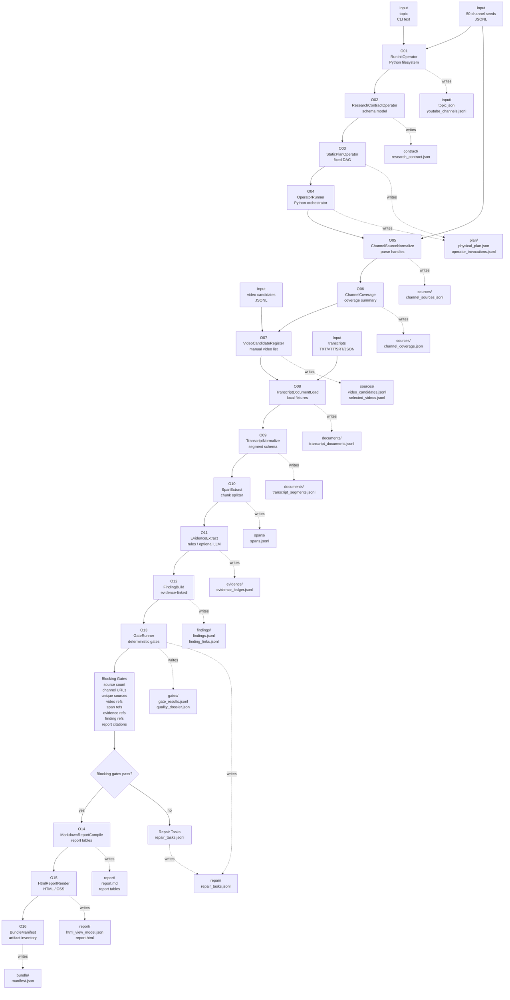
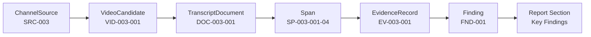

# Pipeline A Phase 0 YouTube System Design

## 1. Purpose

This is a clean-room system design for Pipeline A Phase 0.

It is not a concept note.
It is not only a specification or requirements list.
It is the design layer that explains exactly how the requirements are fulfilled by components, files, schemas, operators, inputs, outputs, gates, and report rendering.

The framing is:

```text
Concept:
  Pipeline A should turn research sources into an auditable research brief.

Requirement:
  Phase 0 should use the 50 YouTube links, preserve traceability, create evidence, and render an HTML report.

Design:
  Store the 50 channel URLs as SourceSeed records, normalize them into ChannelSource records,
  select or manually provide VideoCandidate records, load transcript fixtures into TranscriptDocument records,
  split those documents into timestamped Span records, extract EvidenceRecord rows,
  build lightweight Finding records, run deterministic gates, and render Markdown and HTML from those artifacts.
```

The main design rule:

```text
Open every black box.
```

For example:

```text
"Use sources"
  -> use exactly 50 YouTube channel URLs
  -> parse channel handles
  -> create source records
  -> attach selected videos
  -> attach transcript documents
  -> create spans
  -> create evidence
  -> create findings
  -> create report sections
```

## 2. Phase 0 Scope And System Target

Phase 0 is a working local vertical slice.

The actual system is:

```text
topic
  -> 50 YouTube channel seeds
  -> normalized channel source records
  -> selected video candidates
  -> transcript documents
  -> timestamped transcript spans
  -> evidence records
  -> lightweight findings
  -> deterministic gates
  -> Markdown report
  -> self-contained HTML research brief
  -> bundle manifest
```

The core design choice is that the 50 YouTube links are channel source seeds. A channel is a source container, not evidence by itself. Evidence must come from a specific video transcript, description, or manually supplied excerpt associated with that channel.

Phase 0 therefore has two YouTube layers:

```text
Channel layer:
  parse, normalize, classify, and report coverage of all 50 channels

Video/document layer:
  register a small selected video set and load transcript fixtures for those videos
```

Assumption:

```text
5 days x 8 hours = 40 focused engineering hours
```

Recommended build target:

```text
Minimum strong demo:
  - all 50 channels normalized and shown in source coverage
  - 5 to 10 selected video records
  - 3 to 5 transcript fixtures
  - at least 20 spans
  - at least 8 evidence records
  - at least 4 supported findings
  - all blocking gates pass
  - HTML report renders source coverage, findings, evidence, and gaps
```

This is a real Phase 0, not too much, because the hard parts are bounded:

- no required live YouTube scraping
- no full source discovery
- no full claim graph
- no contradiction search
- no adaptive optimizer

Deferred:

- automatic discovery across the entire web
- automatic video discovery across all 50 channels
- full optimizer
- full ontology
- full claim graph
- contradiction search
- adaptive repair DAG execution
- multi-agent Codex runtime inside the actual pipeline
- dashboard
- persistent database

Phase 0 still keeps the interfaces that make those later upgrades easy: typed artifacts, a physical plan artifact, operator invocation records, deterministic gates, repair tasks, and a report view model.

## 3. Source Corpus

### 3.1 Exact Phase 0 Source Seeds

These 50 channel URLs are the Phase 0 source seed set.

| # | Name | Channel URL | Seed Type |
| --- | --- | --- | --- |
| 1 | Silicon Valley 101 | https://www.youtube.com/@valley101podcast | youtube_channel |
| 2 | HubSpot | https://www.youtube.com/@HubSpotLive | youtube_channel |
| 3 | Microsoft Research | https://www.youtube.com/@MicrosoftResearch | youtube_channel |
| 4 | Open Compute Project | https://www.youtube.com/@OpencomputeOrg | youtube_channel |
| 5 | Stanford Online | https://www.youtube.com/@stanfordonline | youtube_channel |
| 6 | Computer History Museum | https://www.youtube.com/@ComputerHistory | youtube_channel |
| 7 | Databricks | https://www.youtube.com/@Databricks | youtube_channel |
| 8 | Google Cloud | https://www.youtube.com/@googlecloudtech | youtube_channel |
| 9 | Microsoft Cloud | https://www.youtube.com/@MicrosoftAzure | youtube_channel |
| 10 | Erlang Solutions | https://www.youtube.com/@GOTO- | youtube_channel |
| 11 | ITU | https://www.youtube.com/@AIforGood | youtube_channel |
| 12 | Tech Field Day Plus | https://www.youtube.com/@Techfieldday | youtube_channel |
| 13 | ACM India | https://www.youtube.com/@TheOfficialACM | youtube_channel |
| 14 | Bg2 Pod | https://www.youtube.com/@Bg2Pod | youtube_channel |
| 15 | Open Data Science and AI Conference | https://www.youtube.com/@ODSCAI | youtube_channel |
| 16 | UC Berkeley EECS | https://www.youtube.com/@BerkeleyEECS | youtube_channel |
| 17 | USENIX | https://www.youtube.com/@UsenixOrg | youtube_channel |
| 18 | MLOps Clips | https://www.youtube.com/@MLOps | youtube_channel |
| 19 | London Clojurians | https://www.youtube.com/@LondonClojurians | youtube_channel |
| 20 | Google | https://www.youtube.com/@Google | youtube_channel |
| 21 | The Information Bottleneck | https://www.youtube.com/@information_bottleneck | youtube_channel |
| 22 | Google DeepMind | https://www.youtube.com/@googledeepmind | youtube_channel |
| 23 | Moonshots Clips | https://www.youtube.com/@peterdiamandis | youtube_channel |
| 24 | AI Engineer | https://www.youtube.com/@aiDotEngineer | youtube_channel |
| 25 | a16z Deep Dives | https://www.youtube.com/@a16z | youtube_channel |
| 26 | Beyond the Prompt | https://www.youtube.com/@BeyondthePrompt | youtube_channel |
| 27 | Hannah Fry | https://www.youtube.com/@fryrsquared | youtube_channel |
| 28 | YC Root Access | https://www.youtube.com/@ycombinator | youtube_channel |
| 29 | Silicon Valley Vector | https://www.youtube.com/@SiliconValleyVector | youtube_channel |
| 30 | All-In Podcast | https://www.youtube.com/@allin | youtube_channel |
| 31 | Google for Developers | https://www.youtube.com/@GoogleDevelopers | youtube_channel |
| 32 | New York Times Events | https://www.youtube.com/@NewYorkTimesEvents | youtube_channel |
| 33 | Welch Labs | https://www.youtube.com/@WelchLabs | youtube_channel |
| 34 | Center for Strategic & International Studies | https://www.youtube.com/@csis | youtube_channel |
| 35 | WhynotTV | https://www.youtube.com/@whynottv1999 | youtube_channel |
| 36 | Prime Intellect AI | https://www.youtube.com/@PrimeIntellect | youtube_channel |
| 37 | Sequoia Capital | https://www.youtube.com/@sequoiacapital | youtube_channel |
| 38 | Connected DMV | https://www.youtube.com/@connecteddmv3554 | youtube_channel |
| 39 | Anyscale | https://www.youtube.com/@anyscale | youtube_channel |
| 40 | Funding the Commons | https://www.youtube.com/@Funding-the-Commons | youtube_channel |
| 41 | Dwarkesh Clips | https://www.youtube.com/@DwarkeshPatel | youtube_channel |
| 42 | No Priors | https://www.youtube.com/@NoPriorsPodcast | youtube_channel |
| 43 | Interesting Times with Ross Douthat | https://www.youtube.com/@InterestingTimesNYT | youtube_channel |
| 44 | PeopleReign | https://www.youtube.com/@peoplereign | youtube_channel |
| 45 | Berkeley RDI | https://www.youtube.com/@BerkeleyRDI | youtube_channel |
| 46 | Foresight Institute | https://www.youtube.com/@ForesightInstitute | youtube_channel |
| 47 | S3 Science Startups and Stories | https://www.youtube.com/@sciencestartupsandstories | youtube_channel |
| 48 | Out Of Office Podcast | https://www.youtube.com/@lightspeedvp | youtube_channel |
| 49 | Joe Lonsdale Clips | https://www.youtube.com/@Joe_Lonsdale | youtube_channel |
| 50 | Alex Kantrowitz | https://www.youtube.com/@Alex.kantrowitz | youtube_channel |
 
The storage format for these seeds is defined as the `SourceSeed` artifact in Section 7.1.

## 4. System Design Diagram

This is the full Phase 0 system flow. It shows both the operator sequence and the durable artifacts each operator writes.



Diagram legend:

| Label | Meaning |
| --- | --- |
| `U*` | user-supplied input |
| `O*` | executable Phase 0 operator |
| `G*` | gate decision or gate group |
| `R*` | repair output |
| `A*` | durable artifact |
| Solid arrow | execution or artifact handoff |
| Dotted arrow | artifact written by an operator |

### 4.1 Evidence Trace Diagram



### 4.2 Runtime Boundary

The runtime boundary is included to clarify ownership of the run state.

In Phase 0:

```text
Python runner:
  owns the run directory, physical plan, operator order, schemas, gates, and rendering

Manual/rule/LLM helpers:
  may help create candidate evidence or finding text inside specific operators

Gates:
  decide whether candidate artifacts are valid enough to continue
```

Why this matters:

```text
The system is not "an LLM researches and writes a report."
The system is a Python-owned artifact pipeline where optional model assistance is bounded
inside EvidenceExtractOperator and FindingBuildOperator.
```

## 5. Run Directory

Each run creates one directory.

```text
runs/<run_id>/
  input/
    topic.json
    youtube_channels.jsonl
    video_candidates.jsonl
    transcripts/
      <video_id>.txt
      <video_id>.vtt
      <video_id>.srt
      <video_id>.json

  contract/
    research_contract.json

  plan/
    physical_plan.json
    operator_invocations.jsonl

  sources/
    channel_sources.jsonl
    channel_coverage_summary.json
    video_candidates.jsonl
    selected_videos.jsonl

  documents/
    transcript_documents.jsonl
    transcript_segments.jsonl

  spans/
    spans.jsonl

  evidence/
    evidence_ledger.jsonl

  findings/
    findings.jsonl
    finding_evidence_links.jsonl

  gates/
    gate_results.jsonl
    quality_dossier.json

  repair/
    repair_tasks.jsonl

  report/
    report.md
    report.html
    source_map.json
    evidence_table.json
    finding_traceability_table.json

  bundle/
    manifest.json

  trace/
    events.jsonl
```

## 6. Tech Stack

| Layer | Phase 0 Choice | Why |
| --- | --- | --- |
| Orchestration | Python 3.11+ CLI | simple, local, inspectable |
| CLI | `argparse` first, Typer optional | avoid extra dependencies unless useful |
| Models | Pydantic recommended, dataclasses acceptable | structured validation |
| Artifacts | JSONL for rows, JSON for manifests | easy to inspect and append |
| URL parsing | `urllib.parse` + regex | deterministic channel handle extraction |
| Transcript parsing | Python readers for TXT/VTT/SRT/JSON | fixture-first, no network requirement |
| Span extraction | Python chunking | deterministic references |
| Evidence extraction | manual/rule-based first, optional LLM helper | keeps Phase 0 controllable |
| Report templates | Jinja2 or stdlib templates | predictable Markdown/HTML |
| HTML | self-contained HTML/CSS, no required JS | easy to open and share |
| Tests | `pytest` or `unittest` | local validation |
| Future runtime | Codex runtime adapter | later operator execution, not Phase 0 core |

## 7. Core Data Structures And Artifact Schemas

This section defines the durable artifacts written by the system. The operator section later explains which operator creates each artifact.

### 7.1 SourceSeed

Path:

```text
input/youtube_channels.jsonl
```

Schema:

```json
{
  "seed_id": "YS-003",
  "name": "Microsoft Research",
  "url": "https://www.youtube.com/@MicrosoftResearch",
  "source_family": "youtube_channel",
  "category": "AI / Tech",
  "supplied_by": "user",
  "notes": ""
}
```

Why JSONL:

- each channel can carry a display name
- category can be stored up front
- malformed records can be reported by line number
- future source families can share the same seed format

### 7.2 ResearchContract

Path:

```text
contract/research_contract.json
```

Schema:

```json
{
  "contract_id": "RC-20260528-001",
  "topic": "latest technologies in skills governance",
  "research_question": "What signals about the topic are visible in the selected YouTube source set?",
  "audience": "technical_executive",
  "run_mode": "phase0_youtube_vertical_slice",
  "source_policy": {
    "source_seed_file": "input/youtube_channels.jsonl",
    "source_family": "youtube_channel",
    "expected_channel_count": 50,
    "allow_manual_video_candidates": true,
    "allow_local_transcript_fixtures": true,
    "require_live_retrieval": false
  },
  "evidence_policy": {
    "min_transcript_documents": 3,
    "min_evidence_records": 8,
    "strong_finding_min_evidence": 2,
    "moderate_finding_min_evidence": 1
  },
  "report_policy": {
    "formats": ["markdown", "html"],
    "include_all_50_channels": true,
    "include_gaps": true,
    "include_traceability": true
  }
}
```

### 7.3 PhysicalPlan

Path:

```text
plan/physical_plan.json
```

Schema:

```json
{
  "plan_id": "PLAN-P0-YT-001",
  "plan_type": "static",
  "nodes": [
    {
      "node_id": "N01",
      "operator": "RunInitOperator",
      "runtime": "local_python",
      "inputs": ["cli.topic", "cli.youtube_seed_file"],
      "outputs": ["input/topic.json", "input/youtube_channels.jsonl"]
    }
  ],
  "edges": [
    {"from": "N01", "to": "N02"}
  ],
  "stop_conditions": [
    "blocking_gate_failed",
    "report_rendered",
    "operator_exception"
  ],
  "budget": {
    "network_required": false,
    "llm_required": false,
    "max_runtime_minutes": 20
  }
}
```

### 7.4 OperatorInvocation

Path:

```text
plan/operator_invocations.jsonl
```

Schema:

```json
{
  "invocation_id": "OPINV-001",
  "node_id": "N04",
  "operator": "ChannelSourceNormalizeOperator",
  "operator_version": "p0.1",
  "runtime": "local_python",
  "input_artifacts": ["input/youtube_channels.jsonl"],
  "output_artifacts": ["sources/channel_sources.jsonl"],
  "status": "success",
  "started_at": "2026-05-28T09:00:00-04:00",
  "finished_at": "2026-05-28T09:00:01-04:00",
  "metrics": {
    "input_rows": 50,
    "output_rows": 50,
    "invalid_urls": 0,
    "duplicates": 0
  }
}
```

### 7.5 ChannelSource

Path:

```text
sources/channel_sources.jsonl
```

Schema:

```json
{
  "source_id": "SRC-YT-003",
  "seed_id": "YS-003",
  "source_family": "youtube_channel",
  "name": "Microsoft Research",
  "canonical_url": "https://www.youtube.com/@MicrosoftResearch",
  "youtube_handle": "@MicrosoftResearch",
  "category": "AI / Tech",
  "authority_type": "research_lab",
  "source_role": "primary_channel",
  "language_hint": "unknown",
  "status": "registered",
  "status_reason": "",
  "tags": ["ai", "research", "technology"],
  "metadata": {
    "subscriber_count": null,
    "description": null,
    "country": null
  }
}
```

Phase 0 `authority_type` values:

```text
research_lab
university
company
conference
media
podcast
think_tank
investor
individual
unknown
```

### 7.6 VideoCandidate

Path:

```text
sources/video_candidates.jsonl
```

Schema:

```json
{
  "video_id": "VID-003-001",
  "source_id": "SRC-YT-003",
  "channel_handle": "@MicrosoftResearch",
  "youtube_video_id": "abc123",
  "video_url": "https://www.youtube.com/watch?v=abc123",
  "title": "Example video title",
  "published_at": "2026-05-01",
  "duration_seconds": 1800,
  "candidate_origin": "manual_fixture",
  "selection_status": "selected",
  "selection_reason": "topic_relevant_and_transcript_available",
  "transcript_expected": true
}
```

Phase 0 does not need automatic video discovery. It can use a manually supplied `input/video_candidates.jsonl`.

### 7.7 TranscriptDocument

Path:

```text
documents/transcript_documents.jsonl
```

Schema:

```json
{
  "document_id": "DOC-003-001",
  "document_type": "youtube_transcript",
  "source_id": "SRC-YT-003",
  "video_id": "VID-003-001",
  "title": "Example video title",
  "url": "https://www.youtube.com/watch?v=abc123",
  "published_at": "2026-05-01",
  "retrieved_at": "2026-05-28T09:00:00-04:00",
  "transcript_format": "txt",
  "raw_transcript_path": "input/transcripts/abc123.txt",
  "normalized_segments_path": "documents/transcript_segments.jsonl",
  "char_count": 12000,
  "status": "loaded",
  "limitations": ["local transcript fixture"]
}
```

### 7.8 TranscriptSegment

Path:

```text
documents/transcript_segments.jsonl
```

Schema:

```json
{
  "segment_id": "SEG-003-001-0001",
  "document_id": "DOC-003-001",
  "source_id": "SRC-YT-003",
  "video_id": "VID-003-001",
  "start_seconds": 120.0,
  "end_seconds": 136.5,
  "text": "The transcript text for this segment.",
  "segment_index": 1
}
```

For `.txt` transcripts without timestamps:

```json
{
  "start_seconds": null,
  "end_seconds": null
}
```

### 7.9 Span

Path:

```text
spans/spans.jsonl
```

Schema:

```json
{
  "span_id": "SP-003-001-004",
  "document_id": "DOC-003-001",
  "source_id": "SRC-YT-003",
  "video_id": "VID-003-001",
  "start_seconds": 120.0,
  "end_seconds": 220.0,
  "start_char": 1420,
  "end_char": 2350,
  "text": "A chunk of transcript text that can be cited and inspected.",
  "span_kind": "transcript_chunk",
  "youtube_timestamp_url": "https://www.youtube.com/watch?v=abc123&t=120s",
  "token_estimate": 210
}
```

Span rule:

```text
Prefer 300 to 900 characters.
Preserve timestamp boundaries when available.
Do not merge across videos.
```

### 7.10 EvidenceRecord

Path:

```text
evidence/evidence_ledger.jsonl
```

Schema:

```json
{
  "evidence_id": "EV-003-001",
  "source_id": "SRC-YT-003",
  "video_id": "VID-003-001",
  "document_id": "DOC-003-001",
  "span_id": "SP-003-001-004",
  "evidence_type": "expert_statement",
  "summary": "The speaker argues that organizations need governance around skill inference models.",
  "quote": "Short direct excerpt if needed.",
  "relevance": "high",
  "source_quality": "medium",
  "limitations": ["single video source", "requires corroboration"],
  "created_by": "EvidenceExtractOperator",
  "supports_finding_ids": []
}
```

Evidence types:

```text
expert_statement
product_signal
technology_trend
implementation_pattern
market_signal
policy_signal
risk_signal
definition
caveat
open_question
```

### 7.11 Finding

Path:

```text
findings/findings.jsonl
```

Schema:

```json
{
  "finding_id": "FND-001",
  "finding_type": "trend",
  "text": "Skills governance discussions increasingly connect AI inference, data quality, and organizational accountability.",
  "strength": "moderate",
  "confidence": 0.62,
  "evidence_ids": ["EV-003-001", "EV-022-004"],
  "source_ids": ["SRC-YT-003", "SRC-YT-022"],
  "status": "accepted",
  "limitations": ["YouTube-only Phase 0 source set"],
  "report_section": "Key Findings"
}
```

Finding types:

```text
trend
comparison
implementation_pattern
risk
opportunity
recommendation
open_question
```

This is not the full claim graph. It is a flat, evidence-linked claim table that can later be upgraded into a claim graph.

### 7.12 GateResult

Path:

```text
gates/gate_results.jsonl
```

Schema:

```json
{
  "gate_id": "GATE-006",
  "gate_name": "FindingEvidenceGate",
  "status": "pass",
  "severity": "blocking",
  "checked_artifacts": [
    "findings/findings.jsonl",
    "evidence/evidence_ledger.jsonl"
  ],
  "issues": [],
  "repairable": true,
  "repair_suggestions": []
}
```

### 7.13 HtmlReportViewModel

Path:

```text
report/html_view_model.json
```

Schema:

```json
{
  "title": "Pipeline A YouTube Research Brief",
  "topic": "latest technologies in skills governance",
  "run_id": "run-20260528-001",
  "metrics": {
    "channel_count": 50,
    "selected_video_count": 8,
    "transcript_document_count": 5,
    "span_count": 42,
    "evidence_count": 12,
    "finding_count": 5,
    "blocking_gate_failures": 0
  },
  "sections": {
    "source_coverage": [],
    "key_findings": [],
    "evidence_table": [],
    "gaps": [],
    "traceability": []
  }
}
```

## 8. Operators And Gates

This section avoids repeating the same operator information in multiple forms. The table below is the operator contract: purpose, inputs, outputs, implementation, and validation behavior in one place.

| ID | Operator | Purpose | Consumes | Emits | Tech Stack | Key Logic | Validation / Failure Behavior |
| --- | --- | --- | --- | --- | --- | --- | --- |
| O01 | `RunInitOperator` | Create the run directory and copy user inputs. | CLI topic, `inputs/youtube_channels.jsonl`, optional `video_candidates.jsonl`, optional transcripts folder | `input/topic.json`, `input/youtube_channels.jsonl`, copied optional inputs, `trace/events.jsonl` | Python `pathlib`, `datetime`, UUID or slug | Create `run_id`, create folder tree, copy inputs into the run. | Fail on empty topic, missing seed file, unreadable input, or run directory collision. |
| O02 | `ResearchContractOperator` | Turn user intent into explicit run policy. | `input/topic.json`, `input/youtube_channels.jsonl` | `contract/research_contract.json` | Pydantic or dataclasses | Set source family, expected channel count, evidence thresholds, output formats. | Fail if source family is not `youtube_channel` or required policy fields are missing. |
| O03 | `StaticPhysicalPlanOperator` | Create the exact Phase 0 operator plan. | `contract/research_contract.json` | `plan/physical_plan.json` | Python static plan table | Write ordered nodes, edges, artifact paths, runtime choices, stop conditions. | Fail if unknown operator, missing node reference, or cyclic plan. |
| O04 | `OperatorRunner` | Execute the plan and record operator invocations. | `plan/physical_plan.json` and referenced artifacts | `plan/operator_invocations.jsonl`, `trace/events.jsonl` | Local Python orchestrator | Run nodes in DAG order, pass artifact paths, record metrics/status. | Stop on operator exception or blocking gate; preserve partial run state. |
| O05 | `ChannelSourceNormalizeOperator` | Parse and normalize the 50 YouTube channel URLs. | `input/youtube_channels.jsonl` | `sources/channel_sources.jsonl` | `urllib.parse`, regex, schema validation | Extract `@handle`, canonicalize URL, assign `SRC-YT-###`, classify initial authority type. | Block on malformed URL, duplicate canonical URL, duplicate handle, or non-50 official seed set. |
| O06 | `ChannelCoverageOperator` | Summarize channel corpus coverage. | `sources/channel_sources.jsonl` | `sources/channel_coverage_summary.json` | Python counters | Count channels by category, authority type, status, selected videos, transcript coverage. | Warn if many unknown categories; block if channel count conflicts with contract. |
| O07 | `VideoCandidateRegisterOperator` | Attach selected videos to known channels. | `sources/channel_sources.jsonl`, `input/video_candidates.jsonl` | `sources/video_candidates.jsonl`, `sources/selected_videos.jsonl` | JSONL validators, YouTube video URL parser | Validate source references, parse `youtube_video_id`, canonicalize video URL, mark selected rows. | Block if selected video references unknown channel or invalid video URL; warn if selected count below demo target. |
| O08 | `TranscriptDocumentLoadOperator` | Load transcript fixtures for selected videos. | `sources/selected_videos.jsonl`, `input/transcripts/*` | `documents/transcript_documents.jsonl`, raw transcript records | TXT/VTT/SRT/JSON parsers | Match transcript files by video ID, load raw text/captions, preserve origin path and format. | Block malformed loaded transcript; warn on missing transcript; never fabricate text. |
| O09 | `TranscriptNormalizeOperator` | Convert transcript formats into one segment schema. | raw transcript records, `documents/transcript_documents.jsonl` | `documents/transcript_segments.jsonl` | Text cleanup, timestamp normalization | Split TXT into paragraph segments; parse VTT/SRT timestamps; validate JSON segment lists. | Block empty loaded document, invalid timestamp order, or unknown document reference. |
| O10 | `SpanExtractOperator` | Create citeable spans from transcript segments. | `documents/transcript_segments.jsonl` | `spans/spans.jsonl` | Deterministic Python chunking | Group adjacent segments, target 300-900 characters, preserve timestamps, create YouTube timestamp URL when possible. | Block spans that cross documents/videos or reference missing documents. |
| O11 | `EvidenceExtractOperator` | Convert relevant spans into evidence records. | `spans/spans.jsonl`, `contract/research_contract.json` | `evidence/evidence_ledger.jsonl` | Manual records, rules, or optional LLM with schema validation | Select relevant spans, write evidence summary, quote, type, relevance, source quality, limitations. | Block evidence without valid `span_id`; reject invalid enums or unsupported whole-video evidence. |
| O12 | `FindingBuildOperator` | Build lightweight findings from evidence. | `evidence/evidence_ledger.jsonl`, `sources/channel_sources.jsonl` | `findings/findings.jsonl`, `findings/finding_evidence_links.jsonl` | Manual/rules/optional LLM with validation | Group evidence by theme, draft finding text, assign strength/confidence, link evidence IDs. | Block accepted findings without evidence; mark weak findings as tentative or blocked. |
| O13 | `GateRunnerOperator` | Validate artifacts before report finalization. | All core artifacts | `gates/gate_results.jsonl`, `gates/quality_dossier.json`, `repair/repair_tasks.jsonl` | Deterministic Python validators | Run source, URL, video, transcript, span, evidence, finding, citation, and report-readiness gates. | Blocking gates stop before report compilation; warning gates continue but appear in report. |
| O14 | `MarkdownReportCompileOperator` | Compile accepted findings into Markdown and report tables. | contract, channel coverage, findings, evidence, gate results | `report/report.md`, `report/source_map.json`, `report/evidence_table.json`, `report/finding_traceability_table.json` | Jinja2 or stdlib templates | Populate deterministic report sections only from accepted findings and valid evidence. | Fail if citation references missing evidence/span or required report section is missing. |
| O15 | `HtmlReportRenderOperator` | Render the final reviewer-facing HTML brief. | `report/report.md`, report table JSON, `report/html_view_model.json` | `report/report.html` | Self-contained HTML/CSS template | Render source coverage, findings, evidence, gaps, traceability, source appendix. | Fail if HTML hides gate failures, omits traceability, or requires external assets. |
| O16 | `BundleManifestOperator` | Write final run inventory and status. | All required artifacts | `bundle/manifest.json` | Python filesystem inventory | List artifacts, schema version, gate status, report path, metrics, known limitations. | Fail if required artifact is missing or manifest points outside run directory. |

### 8.1 Gates

Gates are part of the system diagram through `GateRunnerOperator`. They are called out separately here because they decide whether the report is allowed to finalize.

Blocking gates:

| Gate | Checks | Failure Behavior |
| --- | --- | --- |
| `SourceSeedCountGate` | exactly 50 channel seeds | block |
| `ChannelUrlGate` | all URLs parse to channel handles | block |
| `UniqueSourceGate` | no duplicate canonical channel URLs | block |
| `SelectedVideoReferenceGate` | each selected video references known channel | block |
| `TranscriptDocumentGate` | loaded documents reference known selected videos | block for invalid refs, warn for missing transcripts |
| `SpanReferenceGate` | each span references known document | block |
| `EvidenceReferenceGate` | each evidence row references known span | block |
| `FindingEvidenceGate` | accepted findings have evidence IDs | block |
| `ReportCitationGate` | report citations resolve to evidence IDs | block |

Warning gates:

| Gate | Checks | Warning |
| --- | --- | --- |
| `TranscriptCoverageGate` | selected videos with transcripts | warn if below target |
| `SourceDiversityGate` | findings draw from multiple channels | warn if narrow |
| `EvidenceVolumeGate` | enough evidence for demo target | warn or block based on contract |

## 9. HTML Report Design

The HTML report is the final human-facing product of Phase 0. The JSON/JSONL artifacts remain the source of truth; HTML is the readable research brief assembled from those artifacts.

Rendered artifact:

```text
report/report.html
```

### 9.1 Exact Section Order

```text
1. Executive Run Summary
   - topic
   - run date
   - gate status
   - source corpus summary
   - what was actually processed
   - what the report can and cannot claim

2. Source Coverage
   - all 50 channels
   - channel handle
   - authority type
   - selected video count
   - transcript document count
   - source status and gaps

3. Key Findings
   - finding text
   - finding type
   - strength
   - confidence
   - evidence count
   - source count
   - linked evidence IDs
   - limitations

4. Evidence Table
   - evidence ID
   - source/channel
   - video
   - span/timestamp
   - summary
   - quote
   - limitations

5. Gaps And Repair Tasks
   - channels not yet used
   - selected videos missing transcripts
   - weak findings
   - warning gates
   - recommended next operators or manual actions

6. Traceability Appendix
   - finding -> evidence -> span -> document -> video -> channel

7. Full Source Appendix
   - exact 50 YouTube channel links
```

### 9.2 Page Layout

The report should use clear whitespace and section bands. It should not be a dense wall of tables.

Practical layout:

```text
+--------------------------------------------------------------------------------+
| Pipeline A YouTube Research Brief                                              |
| Topic: Latest technologies in skills governance                                |
| Run: run-20260528-001   Generated: 2026-05-28   Gate status: PASS              |
+--------------------------------------------------------------------------------+

+------------+-----------------+--------------------+---------+----------+----------+
| 50         | 8               | 5                  | 42      | 12       | 5        |
| Channels   | Selected Videos | Transcript Docs    | Spans   | Evidence | Findings |
+------------+-----------------+--------------------+---------+----------+----------+

Executive Run Summary
  This run normalized 50 YouTube channel seeds, registered 8 selected videos,
  loaded 5 transcript documents, extracted 12 evidence records, and produced
  5 accepted findings. The brief is based only on selected transcript fixtures,
  so unused channels and missing transcripts are listed as gaps.

Source Coverage
  [coverage summary]
  [50-row channel table]

Key Findings
  [finding card]
  [finding card]

Evidence Table
  [evidence rows]

Gaps And Repair Tasks
  [missing transcript and weak coverage rows]

Traceability Appendix
  [finding -> evidence -> span -> document -> video -> channel]

Full Source Appendix
  [all 50 source seeds]
```

### 9.3 Example Finding Card

```text
FND-001  Trend  Strength: moderate  Confidence: 0.62

Skills governance discussions increasingly connect AI inference, data quality,
and organizational accountability.

Evidence:
  EV-003-001  Microsoft Research / Example video / SP-003-001-004
  EV-022-004  Google DeepMind / Example video / SP-022-002-001

Limitations:
  YouTube-only Phase 0 source set; selected transcript fixture sample.
```

Finding display rules:

- accepted findings appear in `Key Findings`
- tentative findings may appear only if clearly labeled
- blocked or unsupported findings must not appear as normal findings
- every accepted finding must show evidence IDs
- single-source findings should show a source-diversity warning

### 9.4 Source Coverage Table

The Source Coverage section must show all 50 channels, not only the channels used for evidence.

| Column | Source Field | Format |
| --- | --- | --- |
| Seed ID | `seed_id` | `YS-003` |
| Source ID | `source_id` | `SRC-YT-003` |
| Name | `name` | plain text |
| Handle | `youtube_handle` | `@MicrosoftResearch` |
| Channel URL | `canonical_url` | clickable link |
| Authority Type | `authority_type` | label |
| Selected Videos | derived count | integer |
| Transcript Docs | derived count | integer |
| Status | `status` | `registered`, `invalid`, `duplicate`, `unused` |
| Notes | `status_reason` or gap summary | short text |

Rows with no selected video should stay visible:

```text
selected_videos = 0
status = registered
notes = not yet used in Phase 0 evidence sample
```

### 9.5 Evidence Table

| Column | Source Field | Format |
| --- | --- | --- |
| Evidence ID | `evidence_id` | `EV-003-001` |
| Type | `evidence_type` | label |
| Summary | `summary` | 1-2 sentences |
| Quote | `quote` | short excerpt |
| Source | `source_id` + channel name | `SRC-YT-003 Microsoft Research` |
| Video | video title and URL | clickable if available |
| Span | `span_id` | `SP-003-001-004` |
| Timestamp | `youtube_timestamp_url` | clickable if available |
| Relevance | `relevance` | low/medium/high |
| Quality | `source_quality` | low/medium/high |
| Limitations | `limitations[]` | semicolon-separated |

Timestamp display:

```text
timestamp available:
  Watch @ 02:00

timestamp missing:
  Transcript span
```

### 9.6 Gaps And Repair Tasks

This section is required because Phase 0 is intentionally partial.

It should show:

- channels with no selected video
- selected videos with missing transcripts
- findings with weak or single-source support
- warning gate results
- blocking gate results if the report is diagnostic only
- recommended next operator or manual action

Repair task table:

| Column | Meaning |
| --- | --- |
| Task ID | stable repair task ID |
| Severity | warning or blocking |
| Problem | concise issue |
| Artifact | artifact that caused the issue |
| Record ID | specific row if available |
| Suggested Operator | next operator to run later |
| Human Action | manual action that can fix it |

### 9.7 Traceability Appendix

Columns:

```text
finding_id
evidence_id
span_id
document_id
video_id
source_id
channel_handle
url_or_timestamp
```

Example:

```text
FND-001 -> EV-003-001 -> SP-003-001-004 -> DOC-003-001 -> VID-003-001 -> SRC-YT-003 -> @MicrosoftResearch -> youtube timestamp
```

### 9.8 HTML Data Dependency Table

| HTML Area | Data Source |
| --- | --- |
| Header | `bundle/manifest.json`, `contract/research_contract.json` |
| Metrics | `sources/channel_coverage_summary.json`, `evidence/evidence_ledger.jsonl`, `findings/findings.jsonl` |
| Source coverage | `sources/channel_sources.jsonl`, `sources/selected_videos.jsonl` |
| Findings | `findings/findings.jsonl`, `findings/finding_evidence_links.jsonl` |
| Evidence table | `evidence/evidence_ledger.jsonl`, `spans/spans.jsonl` |
| Gaps | `gates/quality_dossier.json`, `repair/repair_tasks.jsonl` |
| Traceability | `report/finding_traceability_table.json` |
| Appendix | `input/youtube_channels.jsonl` |

### 9.9 HTML Acceptance Criteria

- The report opens as a single local HTML file.
- The report shows topic, run metadata, and gate status near the top.
- The report shows all 50 channel seeds somewhere in the source appendix.
- The report shows selected videos and transcript availability.
- Accepted findings always show evidence IDs.
- Evidence rows always link back to spans.
- Missing transcripts and unused channels are visible as gaps.
- Gate warnings and blocking failures are visible.
- The traceability appendix reconstructs finding -> evidence -> span -> document -> video -> channel.

## 10. Build Order

### Day 1: Source Spine

Build:

- run directory creator
- `youtube_channels.jsonl`
- `ResearchContract`
- channel URL parser
- `ChannelSource`
- source coverage summary
- parser tests

Demo by end of day:

```text
topic + 50 channel seeds -> source coverage JSON
```

### Day 2: Video And Transcript Fixtures

Build:

- `video_candidates.jsonl` format
- selected video registration
- transcript fixture loader
- TXT/VTT/SRT/JSON parser
- transcript document and segment schemas

Demo by end of day:

```text
selected videos + fixtures -> transcript_documents.jsonl + transcript_segments.jsonl
```

### Day 3: Spans, Evidence, Findings

Build:

- span extractor
- evidence ledger schema
- evidence extraction path
- finding builder
- traceability links

Demo by end of day:

```text
transcripts -> spans -> evidence -> findings
```

### Day 4: Gates And Repairs

Build:

- source gates
- reference gates
- finding support gate
- report citation gate
- quality dossier
- repair task writer
- negative tests

Demo by end of day:

```text
unsupported finding fails before report finalization
```

### Day 5: Report And Bundle

Build:

- Markdown report compiler
- HTML view model
- HTML renderer
- source appendix
- evidence table
- bundle manifest
- integration test

Demo by end of day:

```text
one command creates a full Phase 0 YouTube research bundle
```

## 11. Test Plan

### Unit Tests

```text
test_channel_seed_count_is_50
test_channel_urls_parse_to_unique_handles
test_duplicate_channel_urls_fail
test_selected_video_references_known_source
test_transcript_document_references_selected_video
test_span_references_known_document
test_evidence_references_known_span
test_finding_references_known_evidence
test_report_citations_reference_known_evidence
```

### Integration Test

Input:

```text
topic
50 channel seeds
5 selected videos
3 transcript fixtures
```

Expected:

```text
run directory exists
channel_sources.jsonl has 50 rows
selected_videos.jsonl has at least 5 rows
transcript_documents.jsonl has at least 3 rows
spans.jsonl has nonzero rows
evidence_ledger.jsonl has at least 8 rows
findings.jsonl has at least 4 rows
blocking gates pass
report/report.html exists
bundle/manifest.json exists
```

### Negative Tests

```text
malformed channel URL
  -> ChannelUrlGate fails

selected video references unknown source_id
  -> SelectedVideoReferenceGate fails

evidence references missing span_id
  -> EvidenceReferenceGate fails

accepted finding has no evidence_ids
  -> FindingEvidenceGate fails

report cites nonexistent evidence_id
  -> ReportCitationGate fails
```

## 12. Transition To Later Phases

### Phase 1

Add task-aware planning without changing the evidence spine.

```text
Phase 0:
  fixed physical plan

Phase 1:
  rule-based planner selects source families and operators
```

### Phase 2

Replace manual fixtures with real retrieval where appropriate.

```text
Phase 0:
  local transcript fixtures

Phase 2:
  YouTube transcript adapter
  metadata adapter
  retrieval connectors
```

Outputs stay compatible:

```text
ChannelSource
VideoCandidate
TranscriptDocument
Span
EvidenceRecord
Finding
```

### Phase 3

Upgrade flat findings into a full claim graph.

```text
Phase 0:
  findings.jsonl

Phase 3:
  claim_graph.json
  claim_evidence_edges.jsonl
  contradiction records
  section contracts
```

### Phase 4

Use Codex as an agentic runtime for selected operators.

Good candidates:

```text
EvidenceExtractOperator
FindingBuildOperator
ReportSectionDraftOperator
RepairSuggestionOperator
```

Boundary:

```text
Codex may generate candidate artifacts.
Pipeline A validates and gates them.
Codex does not declare the run accepted.
```

## 13. User Decisions Needed

These should be decided explicitly rather than hidden as assumptions.

1. What is the first demo topic?
2. Should Phase 0 selected videos be manually supplied, or should we attempt limited live YouTube metadata retrieval?
3. How many selected videos should the first demo target: 5, 10, or 20?
4. Should missing transcripts be a warning or a blocking error?
5. Should evidence extraction be manual/rule-based only, or can an LLM propose candidate evidence for Python validation?
6. Should the HTML report target technical readers, executive readers, or a hybrid?

## 14. Definition Of Done

Phase 0 is done when:

```text
A local command can take a topic and the 50 YouTube channel seeds,
create a run directory, normalize the channel sources, register selected videos,
load transcript fixtures, create spans, create evidence, create findings,
run gates, block unsupported outputs, and render a self-contained HTML report
where each finding traces back to evidence, span, document, video, and channel records.
```
