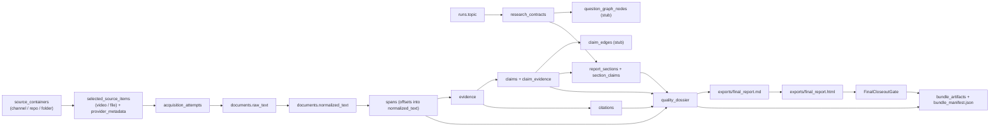
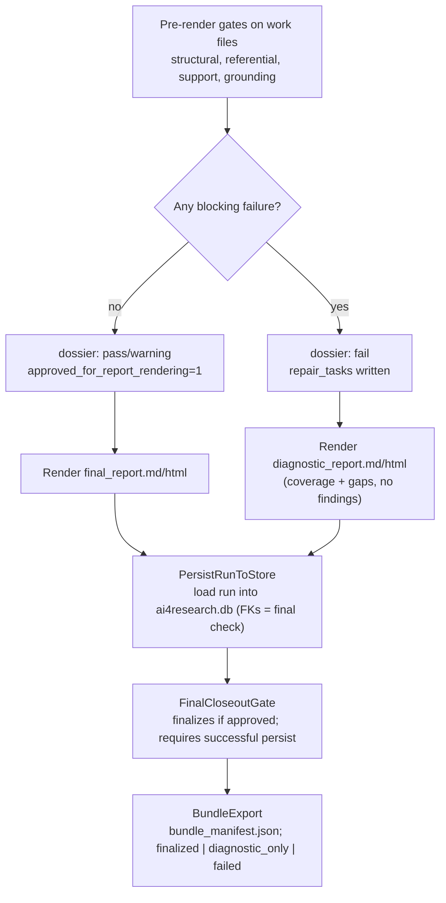

# Pipeline A Phase 0 Design

## 1. Purpose

This document defines the white-box system design for Pipeline A Phase 0.

Phase 0 is a deterministic, **file-first**, **source-agnostic** research-compiler skeleton. It turns a bounded user topic and a bounded, user-supplied source pack into typed artifacts: source containers, selected source items, document acquisition attempts, documents, spans, evidence, minimal claims, gate results, and exported reports.

Objective: make each step explicit while keeping the engine independent of any specific source family:

- "Take sources" becomes explicit source containers, selected source items, acquisition attempts, source adapters, document rows, normalized text, and spans.
- "Extract evidence" becomes deterministic span selection plus evidence-card rows with schema validation.
- "Build claims" becomes `claims` rows linked to evidence via a junction table.
- "Write report" becomes section rows compiled only from accepted claim IDs and rendered citations, then exported to Markdown/HTML files.
- "Quality review" becomes specific gates that read rows and write structured pass/fail rows.

**Storage model.** During a run, operators read and write JSON/JSONL working files under the run directory. After rendering, `PersistRunToStore` loads the run into SQLite (`ai4research.db`) in one transaction. The same Pydantic models serialize to working files and store rows, so Section 6 is both the load target and the durable record.

### 1.1 The Phase 0 Design Principle

The design follows one principle:

> **Phase 0 is the smallest source-agnostic skeleton that runs end-to-end on a fixture corpus and locks the contracts the later phases extend.**

Two rules follow, applied to every operator, table, and gate:

1. **Every element exists because it serves a Phase 0 goal** — flexibility (a source-agnostic core), readiness (a seam later phases plug into), or the ability to feed the project's preset sources today. Anything else is deferred.
2. **Every element exists because it protects a future seam.** Phase 0 is measured by whether the data contracts (the SQLite schema) and the executor survive Phases 1–4 unchanged, not by operator count.

### 1.2 Source-Agnostic Core

The Phase 0 core branches only on generic rows. Domain-specific strategies, scoring, and vocabulary ("domain packs") arrive later. Every source family — YouTube, GitHub, web, policy — is a `SourceAdapter` registered against one lifecycle:

```text
source_containers -> selected_source_items -> acquisition_attempts -> documents -> spans -> evidence -> claims
```

Each source family maps onto that lifecycle the same way:

| Generic entity | YouTube | GitHub | Local |
| --- | --- | --- | --- |
| `source_container` (a named collection, not a document) | a **channel** | a **repo** | a **folder/set** |
| `selected_source_item` (the acquirable leaf) | a **video** | a **file / README** | a **file** |
| `acquisition_attempt` | load transcript fixture (Phase 2: live fetch) | load file fixture (Phase 2: API read) | read local file |
| `document` | transcript text | file text | file text |

A channel has no transcript, so the channel is the *container* and the video is the *item*. The same shape covers GitHub (repo → file). A 50-channel preset is 50 `source_containers` rows; a channel with no staged video is a container with zero selected items and appears as a coverage gap.

Provider-specific data (YouTube handles/timestamps, GitHub SHAs/stars) lives only in `provider_metadata` on `selected_source_items` and `documents`. Generic columns in `selected_source_items`, `spans`, `evidence`, and `claims` contain no `youtube_*`/`github_*` fields. `ProviderFieldQuarantineGate` enforces this.

The required first adapter is `local_document_file`: a plain local `.md` flowing through the full spine proves the spine is not YouTube-specific. The `youtube_transcript_fixture` adapter is then built through the same interface and is required for the Phase 0 proving run (Section 14.2); `github_file_fixture` is optional, built the same way when needed.

## 2. Phase 0 Scope And System Target

### 2.1 In Scope

- Create a run and a per-run directory (`input/`, `work/`, `exports/`) from a user topic.
- Convert the topic into a deterministic `research_contracts` row (no LLM).
- Emit a real, trivial one-node question graph (the seam Phase 1 fills with generated questions).
- Write static `physical_plan_nodes`/`_edges` rows from an `operator_specs` registry, with a `runtime` value on every plan node.
- Accept a user-provided source pack of any supported family.
- Split source handling into container, selected item, acquisition attempt, and document, per the Section 1.2 mapping.
- Support a real `SourceAdapter` interface: a **required** `local_document_file` adapter (proves the spine first), a `youtube_transcript_fixture` adapter built after it and required for the proving run, and an optional `github_file_fixture` adapter.
- Record an `acquisition_attempts` row for every selected item, including fixtures and failures.
- Normalize documents into a canonical `normalized_text`; split into stable, offset-anchored spans.
- Build evidence rows from spans, then `claims` rows from evidence (linked via `claim_evidence`).
- Validate referential integrity, span offsets, the provider-field quarantine, claim support, and report grounding.
- Compile Markdown and HTML reports from accepted claims only; export them as files tracked in `artifact_exports`.
- Record `operator_invocations`, a quality dossier, and a bundle manifest for every run (finalized, diagnostic-only, or failed), then load the whole run into the SQLite store.
- Fail closed when evidence, claim, citation, or report references are invalid.
- Provide contract tests asserting that later-phase operators must emit the same row shapes.

### 2.2 Out Of Scope (deferred, with seams reserved)

- Live web search, automatic YouTube downloading, live GitHub API reads, browser automation.
- LLM-based extraction or planning.
- Question-graph *generation* (the stub row exists; generation is Phase 1).
- Domain-pack *selection* / classifier; rule-based or score-based optimizer.
- Heavy document parsing (HTML boilerplate stripping, PDF extraction) — Phase 2.
- Full claim-graph semantics: contradiction, entailment, deduplication, multi-claim-per-span — Phase 2/3.
- Acquisition *machinery*: retries, backoff, rate-limit handling, multi-provider fallback — Phase 2.
- Adaptive repair *execution* (repair tasks are recorded, not executed); large ontology; multi-agent / Codex runtime; long-form synthesis.
- Multi-run analytics, dashboards, server/ORM layers (raw `sqlite3` + typed models is enough for Phase 0).

### 2.3 Seams Built in Phase 0

These four seams are built in Phase 0 because retrofitting them later would force a schema change:

1. **`physical_plan_*` rows written by a static optimizer** + `optimizer_decisions` rows — the swap point for the Phase 1 rule optimizer and Phase 2 score optimizer.
2. **An `operator_specs` registry + `Operator` base contract** — the Phase 1 modularity seam.
3. **A `runtime` column on every plan node** (default `local_python`) — the Phase 4 Codex-dispatch seam.
4. **A real one-node question graph** — the Phase 1 question-generation seam (replace the body, not insert a node).

### 2.4 Phase 0 Decisions

- Working state during a run is file-first (JSON/JSONL under `<run_id>/work/`); after the report is rendered, `PersistRunToStore` loads the run into a **single SQLite store** (`ai4research.db`) — the durable, queryable record.
- The initial source set is explicitly supplied; Phase 0 does not discover sources.
- Phase 0 accepts any positive number of items. The project may supply ~50 YouTube channels and a set of GitHub repos; tests use tiny local packs. Counts are contract config, never hardcoded.
- A YouTube item is a video URL plus a supplied transcript fixture; a GitHub item is a repo file plus a supplied file fixture. Network fetching is out of scope.
- Channel/repo = container; video/file = item; transcript/file text = document (Section 1.2).
- One `claims` row per evidence row by default; multiple claims per span deferred.
- `published_at`/provider metadata may be `null`; missing → warning, not blocking.
- Pydantic v2 models map 1:1 to both working files and store rows — one set of contracts. Working files are canonical during the run; the SQLite store is the durable record after.
- Gates run before rendering; rendering is blocked unless the dossier approves it.
- Missing acquisition is a failed `acquisition_attempts` row; it blocks rendering only when contract coverage thresholds are unmet.
- A bundle manifest row set + exported `bundle_manifest.json` is written for finalized, diagnostic-only, and failed runs.
- The source-agnostic rule is enforced by a blocking gate.

## 3. Source Corpus

Phase 0 treats the source corpus as a bounded, user-supplied source pack loaded into `source_containers` and `selected_source_items`. The pack may be tiny in tests or the real project set (YouTube channels, GitHub repos, or a mix). Sources enter through generic rows, not source-specific pipeline code.

The Phase 0 source path is:

```text
source_containers      (channel / repo / folder)
  -> selected_source_items   (video / file)
  -> acquisition_attempts
  -> documents (raw)
  -> documents.normalized_text
  -> spans
  -> evidence
```

**Preset ingestion in Phase 0.** Preset links (about 50 YouTube channels and the GitHub repos) load as rows and validate as seeds. The coverage section lists every container, including channels/repos with no staged fixture. Items with a staged transcript/file fixture flow end-to-end to the report. Live acquisition is Phase 2 and uses the same `SourceAdapter` interface.

## 4. System Design Diagram

```mermaid
flowchart TD
  U["User input\nFormat: topic string + optional run config\nExample: latest technologies in skills governance"]
  O0["O0 RunInitializeOperator\nIn: TopicInput\nOut: run dir (input/ work/ exports/) + operator_specs seed"]
  O1["O1 ResearchContractOperator\nIn: topic\nOut: work/research_contract.json"]
  O2["O2 QuestionGraphStubOperator\nIn: contract\nOut: work/question_graph.json (one node)"]
  O3["O3 StaticPlanOperator\nIn: contract + operator_specs\nOut: work/physical_plan.json + optimizer_decisions.jsonl"]
  O4["O4 SourceContainerLoadOperator\nIn: input/source_containers.jsonl\nOut: work/source_containers.jsonl"]
  O5["O5 SourceItemSelectOperator\nIn: source containers\nOut: work/selected_source_items.jsonl"]
  O6["O6 DocumentAcquisitionOperator\nTech: SourceAdapter registry\nIn: items + input/fixtures\nOut: work/acquisition_attempts.jsonl + work/documents (raw)"]
  O7["O7 DocumentNormalizeOperator\nIn: raw documents\nOut: work/documents (normalized_text)"]
  O8["O8 SpanSegmentOperator\nIn: normalized docs\nOut: work/spans.jsonl"]
  O9["O9 EvidenceCardBuildOperator\nIn: spans\nOut: work/evidence.jsonl"]
  O10["O10 ClaimLiteBuildOperator\nIn: evidence\nOut: work/claims.jsonl + claim_evidence.jsonl"]
  O11["O11 CitationMapBuildOperator\nIn: evidence + spans + documents + items\nOut: work/citations.jsonl"]
  O12["O12 ReportBlueprintOperator\nIn: contract + claims + citations\nOut: work/report_sections.jsonl + section_claims.jsonl"]
  G["G PreRenderQualityGateSuite\nIn: all work/ files\nOut: work/gate_results.jsonl + quality_dossier.json + repair_tasks.jsonl"]
  O13["O13 MarkdownReportCompileOperator\nIn: sections + citations + passing dossier\nOut: exports/final_report.md (or diagnostic_report.md)"]
  O14["O14 HtmlRenderOperator\nIn: the compiled Markdown\nOut: exports/*.html"]
  P["O15 PersistRunToStore\nIn: all work/ files\nOut: load run into ai4research.db (one txn; FKs = final integrity check)"]
  F["F FinalCloseoutGate\nIn: exported report + dossier + store-load result\nOut: closeout gate_results (passes only if persist succeeded)"]
  B["B BundleExportOperator\nIn: store + exports\nOut: exports/bundle_manifest.json (+ bundle_artifacts)"]
  R["Final research bundle\nSQLite store + exported MD/HTML/JSON"]

  U --> O0 --> O1 --> O2 --> O3 --> O4 --> O5 --> O6 --> O7 --> O8 --> O9 --> O10 --> O11 --> O12 --> G --> O13 --> O14 --> P --> F --> B --> R
  O3 --> G
  O8 --> G
  O9 --> G
  O11 --> G
  O12 --> G
```



### 4.1 Input And Output Contract By Step

During a run, operators write JSON/JSONL working files; `PersistRunToStore` loads them into SQLite at the end. Only render and bundle steps write export files.

| Step | Operator | Reads | Writes (work files; loaded to the store at the end) | Blocking Validation |
| --- | --- | --- | --- | --- |
| O0 | `RunInitializeOperator` | `TopicInput` | run dir (`input/ work/ exports/`); `operator_specs` seed | run ID unique |
| O1 | `ResearchContractOperator` | topic | `work/research_contract.json` | topic non-empty, required dimensions present |
| O2 | `QuestionGraphStubOperator` | contract | `work/question_graph.json` | exactly one root node |
| O3 | `StaticPlanOperator` | contract, `operator_specs` | `work/physical_plan.json`, `optimizer_decisions.jsonl` | operators registered, DAG acyclic, every required artifact has a producer, every node has a `runtime` |
| O4 | `SourceContainerLoadOperator` | `input/source_containers.jsonl` | `work/source_containers.jsonl` | container IDs unique, pack type supported |
| O5 | `SourceItemSelectOperator` | source containers | `work/selected_source_items.jsonl` | item IDs unique, container ref valid, adapter registered |
| O6 | `DocumentAcquisitionOperator` | selected items + fixtures | `work/acquisition_attempts.jsonl`, `work/documents/` (raw) | every item yields a document or a structured failed attempt |
| O7 | `DocumentNormalizeOperator` | raw documents | `work/documents/` (normalized_text + hash) | normalized text non-empty, hash present |
| O8 | `SpanSegmentOperator` | normalized docs | `work/spans.jsonl` | `normalized_text[start:end] == span text` |
| O9 | `EvidenceCardBuildOperator` | spans | `work/evidence.jsonl` | references valid span/document/item; no provider fields |
| O10 | `ClaimLiteBuildOperator` | evidence | `work/claims.jsonl`, `claim_evidence.jsonl`, `claim_edges.jsonl` | every accepted claim has ≥1 `claim_evidence` |
| O11 | `CitationMapBuildOperator` | evidence, spans, documents, items | `work/citations.jsonl` | each citation resolves the full evidence→span→document→item path |
| O12 | `ReportBlueprintOperator` | contract, claims, citations | `work/report_sections.jsonl`, `section_claims.jsonl`, `section_citations.jsonl` | sections reference existing claims/citations |
| G | `PreRenderQualityGateSuite` | all work files | `work/gate_results.jsonl`, `quality_dossier.json`, `repair_tasks.jsonl` | hard-fail blocks rendering |
| O13 | `MarkdownReportCompileOperator` | sections + claims + citations + passing dossier | export `final_report.md` (or `diagnostic_report.md`) | uses only pre-gated sections |
| O14 | `HtmlRenderOperator` | the compiled Markdown | export `*.html` | HTML has title + citations |
| O15 | `PersistRunToStore` | all work files | load run into `ai4research.db` (one transaction) | foreign keys resolve; load fails on any broken reference |
| F | `FinalCloseoutGate` | exported report + dossier + store-load result | closeout `gate_results` | exports exist; only approved citations/claims; **persist succeeded** |
| B | `BundleExportOperator` | store + exports | export `bundle_manifest.json` (+ `bundle_artifacts`) | manifest hashes exports + records final status |

## 5. Run Layout

The per-run directory holds user inputs, working files, and exported reports. `PersistRunToStore` loads the working files into the shared SQLite store.

```text
runs/
  ai4research.db                       # durable SQLite store; each run is loaded here at the end
  <run_id>/
    input/
      run_config.json                  # optional
      source_containers.jsonl          # user-supplied (containers with nested items)
      fixtures/
        transcripts/<id>.txt           # supplied YouTube video transcript fixtures
        documents/<id>.md              # supplied local text/markdown fixtures
        repos/<id>.md                  # supplied GitHub file/README fixture snapshots
    work/                              # file-first working state (one JSON/JSONL per Section 7 table)
      research_contract.json
      question_graph.json
      physical_plan.json
      operator_invocations.jsonl
      source_containers.jsonl
      selected_source_items.jsonl
      acquisition_attempts.jsonl
      documents/                       # raw + normalized text per document
      spans.jsonl
      evidence.jsonl
      claims.jsonl
      citations.jsonl
      report_sections.jsonl
      gate_results.jsonl
      quality_dossier.json
    exports/
      final_report.md                  # finalized runs only
      final_report.html
      diagnostic_report.md             # blocked/failed runs, instead of final_report
      diagnostic_report.html
      bundle_manifest.json             # every run
```

The store location is configurable. A shared `ai4research.db` keeps runs queryable in one place; one DB per run remains an option with the same schema.

## 6. Data Foundation: SQLite Schema

During a run, each operator writes JSON/JSONL working files; `PersistRunToStore` loads them into SQLite at the end. The schema below is the load target and durable record. It replaces per-record metadata envelopes: there is **no** `schema_name`/`schema_version`/`created_at`/`created_by_operator`/`record_hash` on every record. Instead:

- **Primary keys** identify every entity (`evidence.evidence_id`, `spans.span_id`, …).
- **Foreign keys** express references and are enforced at load (`PRAGMA foreign_keys = ON`); a broken reference fails the load. During the run, gates check working-file references. Foreign keys guarantee each reference resolves; `ReferenceIntegrityGate` checks cross-path consistency, such as `evidence.document_id` matching the document behind `evidence.span_id`. Primary keys are globally unique (run-prefixed or UUID).
- **`run_id` foreign keys** link entity tables to `runs`.
- **`operator_invocations` rows** capture provenance once per operator run.
- **`artifact_exports` rows** track only files written to disk.
- **`schema_meta`** holds the single schema version and migration log, instead of a version on every row.
- Content hashes are limited to `documents.content_hash`, `spans.text_hash`, and `artifact_exports.sha256`.

### 6.1 Foundation Tables

```sql
PRAGMA foreign_keys = ON;

CREATE TABLE schema_meta (
  key            TEXT PRIMARY KEY,        -- e.g. 'schema_version'
  value          TEXT NOT NULL
);

CREATE TABLE runs (
  run_id         TEXT PRIMARY KEY,
  topic          TEXT NOT NULL,
  phase          TEXT NOT NULL DEFAULT 'phase0',
  status         TEXT NOT NULL,           -- initialized | running | finalized | diagnostic_only | failed
  started_at     TEXT NOT NULL,
  completed_at   TEXT,
  root_dir       TEXT NOT NULL
);

CREATE TABLE operator_specs (             -- the operator registry
  operator_name  TEXT PRIMARY KEY,
  version        TEXT NOT NULL,
  input_schemas  TEXT NOT NULL,           -- JSON array
  output_schemas TEXT NOT NULL,           -- JSON array
  runtime        TEXT NOT NULL DEFAULT 'local_python'
);

CREATE TABLE physical_plan_nodes (        -- the static plan's steps
  node_id        TEXT PRIMARY KEY,
  run_id         TEXT NOT NULL REFERENCES runs(run_id),
  operator_name  TEXT NOT NULL REFERENCES operator_specs(operator_name),
  runtime        TEXT NOT NULL DEFAULT 'local_python',
  order_index    INTEGER NOT NULL
);

CREATE TABLE physical_plan_edges (        -- which step feeds which
  run_id    TEXT NOT NULL REFERENCES runs(run_id),
  from_node TEXT NOT NULL REFERENCES physical_plan_nodes(node_id),
  to_node   TEXT NOT NULL REFERENCES physical_plan_nodes(node_id),
  artifact  TEXT                          -- the table dependency this edge carries
);

CREATE TABLE optimizer_decisions (        -- why the static plan looks the way it does
  decision_id             TEXT PRIMARY KEY,
  run_id                  TEXT NOT NULL REFERENCES runs(run_id),
  reason                  TEXT NOT NULL,
  alternatives_considered TEXT            -- JSON array; empty in Phase 0
);

CREATE TABLE operator_invocations (       -- provenance + trace, one row per operator run
  invocation_id  TEXT PRIMARY KEY,
  run_id         TEXT NOT NULL REFERENCES runs(run_id),
  node_id        TEXT REFERENCES physical_plan_nodes(node_id),
  operator_name  TEXT NOT NULL REFERENCES operator_specs(operator_name),
  operator_version TEXT NOT NULL,
  runtime        TEXT NOT NULL,
  started_at     TEXT NOT NULL,
  completed_at   TEXT,
  status         TEXT NOT NULL,           -- success | failed | skipped
  metrics        TEXT,                    -- JSON
  error          TEXT
);

CREATE TABLE artifact_exports (           -- ONLY files written to disk
  export_id      TEXT PRIMARY KEY,
  run_id         TEXT NOT NULL REFERENCES runs(run_id),
  path           TEXT NOT NULL,           -- relative to run dir
  kind           TEXT NOT NULL,           -- markdown_report | html_report | diagnostic_report | bundle_manifest | json_export
  sha256         TEXT NOT NULL,
  created_by_invocation_id TEXT REFERENCES operator_invocations(invocation_id),
  created_at     TEXT NOT NULL
);
```

These foundation tables are the orchestration and metadata layer. What an artifact envelope used to carry is now a PK, FK, `operator_invocations` row, or `artifact_exports` row.

### 6.2 Convention For Entity Tables

Entity tables use a string PK, a `run_id` FK to `runs`, and FKs for every reference. Nested or variable structures (policies, locators, provider metadata, limitations) use JSON `TEXT` where separate tables would add unnecessary Phase 0 complexity. Provider-specific data is limited to `provider_metadata` on `selected_source_items` and `documents`. Rows do **not** carry `created_by_operator`/`created_at`; provenance is recorded in `operator_invocations`. Enum-like columns (statuses, types, families) are documented as comments and enforced by the Pydantic write layer before insert; SQLite `CHECK` constraints may be added later but are not required in Phase 0.

## 7. Core Data Structures (Tables)

Each subsection is a table. Column lists are the Phase 0 contract; Pydantic v2 models mirror them 1:1. The **source-agnostic invariant** applies throughout: `selected_source_items` (outside `provider_metadata`), `spans`, `evidence`, and `claims` contain no provider-specific columns. `ProviderFieldQuarantineGate` enforces this.

### 7.1 TopicInput (transient input, not a table)

The CLI accepts a topic; O0 writes a `runs` row and stores the optional `input/run_config.json`. `topic` must be non-empty. Phase 0 infers no hidden constraints.

### 7.2 runs

See §6.1. The root parent of every other row.

### 7.3 research_contracts

```sql
CREATE TABLE research_contracts (
  contract_id    TEXT PRIMARY KEY,
  run_id         TEXT NOT NULL REFERENCES runs(run_id),
  topic          TEXT NOT NULL,
  research_type  TEXT NOT NULL,           -- 'source_pack_evidence_report'
  audience       TEXT,
  freshness_required INTEGER NOT NULL DEFAULT 0,
  freshness_window_days INTEGER,
  source_policy  TEXT NOT NULL,           -- JSON: allowed_source_pack_types, allowed_source_adapters,
                                          --       minimum_source_count, expected_source_count (nullable), exact_source_list_required
  required_dimensions TEXT NOT NULL,      -- JSON array
  critical_claim_policy TEXT NOT NULL,    -- JSON: minimum_supporting_evidence, allow_unsupported_critical_claims=false
  deliverables   TEXT NOT NULL            -- JSON array
);
```

`source_policy.allowed_source_pack_types = ["local_document_set","youtube_channel","github_repo"]`. `expected_source_count` is config and may be `null`; it is never a hardcoded `== 50` gate. `SourceCoverageGate` blocks when fewer than `minimum_source_count` sources are present, and warns otherwise.

### 7.4 question_graph_nodes / question_graph_edges

Phase 0 writes one root node equal to the topic. Phase 1 replaces the producing operator body with generated nodes/edges without changing the spine.

```sql
CREATE TABLE question_graph_nodes (
  node_id TEXT PRIMARY KEY,
  run_id  TEXT NOT NULL REFERENCES runs(run_id),
  type    TEXT NOT NULL,                  -- 'root_question' in Phase 0
  text    TEXT NOT NULL,
  status  TEXT NOT NULL DEFAULT 'open'
);
CREATE TABLE question_graph_edges (
  run_id  TEXT NOT NULL REFERENCES runs(run_id),
  from_node TEXT NOT NULL REFERENCES question_graph_nodes(node_id),
  to_node   TEXT NOT NULL REFERENCES question_graph_nodes(node_id),
  type    TEXT NOT NULL
);
```

### 7.5 source_containers

A named collection that yields candidate items but is not itself a document: a YouTube **channel**, GitHub **repo**, or local **folder/set**.

```sql
CREATE TABLE source_containers (
  container_id     TEXT PRIMARY KEY,
  run_id           TEXT NOT NULL REFERENCES runs(run_id),
  source_pack_type TEXT NOT NULL,         -- 'local_document_set' | 'youtube_channel' | 'github_repo'
  container_locator TEXT,                 -- channel URL / repo URL / folder path
  label            TEXT,
  container_rank   INTEGER,               -- preserves user order
  user_supplied    INTEGER NOT NULL DEFAULT 1
);
```

Supported Phase 0 container types and their items:

| source_pack_type | Container is | Item is | Required item locator | Default adapter |
| --- | --- | --- | --- | --- |
| `local_document_set` | a folder/set | a file | `local_path` or `inline_text` | `local_document_file` |
| `youtube_channel` | a channel | a video | `url` + (`local_fixture_path` or `inline_text`) | `youtube_transcript_fixture` |
| `github_repo` | a repo | a file/README | `url` + `local_fixture_path` | `github_file_fixture` |

A 50-channel preset = 50 `source_containers` rows of type `youtube_channel`. A channel with no selected videos = a container with zero `selected_source_items` = a coverage gap.

**Input shape.** `input/source_containers.jsonl` contains one container per line, each with a nested `items` array. `O4 SourceContainerLoadOperator` writes `source_containers`; `O5 SourceItemSelectOperator` expands items into `selected_source_items` (Phase 0 selects all). An empty `items` array is a valid coverage gap.

```json
{
  "container_id": "C-YT-001",
  "source_pack_type": "youtube_channel",
  "container_locator": "https://www.youtube.com/@example",
  "label": "Example channel",
  "items": [
    {
      "item_id": "I-YT-001-01",
      "item_locator": { "url": "https://www.youtube.com/watch?v=abc123", "local_fixture_path": "input/fixtures/transcripts/abc123.txt" },
      "title": "Example talk",
      "provider_metadata": { "video_id": "abc123" }
    }
  ]
}
```

### 7.6 selected_source_items

The acquirable leaf selected from a container: a video, repo file, or local file. Phase 0 selects all supplied items; later phases can rank, filter, dedupe, or budget at this boundary.

```sql
CREATE TABLE selected_source_items (
  selected_item_id   TEXT PRIMARY KEY,
  run_id             TEXT NOT NULL REFERENCES runs(run_id),
  container_id       TEXT NOT NULL REFERENCES source_containers(container_id),
  source_family      TEXT NOT NULL,       -- generic routing key: 'local_document'|'youtube_video'|'github_file'
  adapter_id         TEXT NOT NULL,
  item_locator       TEXT NOT NULL,       -- JSON: url / local_path / local_fixture_path / inline_text
  title              TEXT,
  creator            TEXT,
  published_at       TEXT,
  accessed_at        TEXT,
  source_rank        INTEGER,
  selection_reason   TEXT,                -- 'Phase 0 include_all policy'
  acquisition_status TEXT NOT NULL DEFAULT 'pending',
  provider_metadata  TEXT                 -- JSON: youtube_handle, video_id, github_path, sha, ... (engine never reads)
);
```

`source_family` is an open routing value for adapter selection; the engine does not special-case individual values. Generic operators must not depend on `provider_metadata`; adapters (for acquisition) and render helpers (for deep links) may read it.

### 7.7 acquisition_attempts

The attempt to turn one selected item into a document. **Every selected item gets at least one attempt row, even on failure.** This records why an item produced no document and preserves the `item -> attempt -> document` shape Phase 2 retrieval reuses. Retries, backoff, rate limits, and multi-provider fallback are Phase 2.

```sql
CREATE TABLE acquisition_attempts (
  attempt_id       TEXT PRIMARY KEY,
  run_id           TEXT NOT NULL REFERENCES runs(run_id),
  selected_item_id TEXT NOT NULL REFERENCES selected_source_items(selected_item_id),
  adapter_id       TEXT NOT NULL,
  attempt_number   INTEGER NOT NULL DEFAULT 1,
  started_at       TEXT NOT NULL,
  completed_at     TEXT,
  status           TEXT NOT NULL,         -- succeeded | failed | skipped
  input_locator    TEXT,                  -- JSON
  failure_code     TEXT,                  -- e.g. 'local_fixture_missing'
  failure_message  TEXT,
  retryable        INTEGER NOT NULL DEFAULT 0
);
```

The common Phase 0 gap (a seed whose fixture is absent) is a row with `status='failed'`, `failure_code='local_fixture_missing'`.

### 7.8 documents

```sql
CREATE TABLE documents (
  document_id          TEXT PRIMARY KEY,
  run_id               TEXT NOT NULL REFERENCES runs(run_id),
  selected_item_id     TEXT NOT NULL REFERENCES selected_source_items(selected_item_id),
  acquisition_attempt_id TEXT NOT NULL REFERENCES acquisition_attempts(attempt_id),
  document_kind        TEXT NOT NULL,     -- 'youtube_transcript' | 'github_document' | 'local_document'
  title                TEXT,
  raw_text             TEXT NOT NULL,
  normalized_text      TEXT,              -- set by O7; spans index THIS, never raw_text
  language             TEXT,
  published_at         TEXT,
  content_hash         TEXT NOT NULL,
  normalization        TEXT,              -- JSON: rules_applied, removed_content
  provider_metadata    TEXT               -- JSON: video_id, repo sha, ...
);
```

Raw text is preserved. **`normalized_text` is the canonical text; all span offsets are defined against it.**

### 7.9 spans

```sql
CREATE TABLE spans (
  span_id            TEXT PRIMARY KEY,
  run_id             TEXT NOT NULL REFERENCES runs(run_id),
  document_id        TEXT NOT NULL REFERENCES documents(document_id),
  selected_item_id   TEXT NOT NULL REFERENCES selected_source_items(selected_item_id),
  span_index         INTEGER NOT NULL,
  start_char         INTEGER NOT NULL,
  end_char           INTEGER NOT NULL,
  text               TEXT NOT NULL,
  segmentation_strategy TEXT NOT NULL,
  text_hash          TEXT NOT NULL
);
```

Paragraph-first chunking; paragraphs over ~900 chars split into ~700–900-char sentence-aware windows; offsets into `normalized_text`; no empty spans. No `youtube_timestamp_url` column — a deep-link, if needed later, is derived at render time from the document's `provider_metadata`.

### 7.10 evidence

```sql
CREATE TABLE evidence (
  evidence_id      TEXT PRIMARY KEY,
  run_id           TEXT NOT NULL REFERENCES runs(run_id),
  selected_item_id TEXT NOT NULL REFERENCES selected_source_items(selected_item_id),
  document_id      TEXT NOT NULL REFERENCES documents(document_id),
  span_id          TEXT NOT NULL REFERENCES spans(span_id),
  evidence_type    TEXT NOT NULL,         -- definition|source_statement|example|risk|recommendation|limitation|unknown
  summary          TEXT NOT NULL,
  quoted_text      TEXT NOT NULL,         -- contained within the span text
  support_strength TEXT,
  limitations      TEXT,                  -- JSON array
  published_at     TEXT
);
```

### 7.11 claims (ClaimLite)

The minimal Phase 0 claim, not the full claim-graph node. Evidence links use the `claim_evidence` junction table, so support is a relational FK.

```sql
CREATE TABLE claims (
  claim_id     TEXT PRIMARY KEY,
  run_id       TEXT NOT NULL REFERENCES runs(run_id),
  claim_type   TEXT NOT NULL,             -- definition|technical_fact|risk_claim|recommendation_claim
  claim_text   TEXT NOT NULL,
  claim_scope  TEXT NOT NULL,             -- 'within provided source set'
  criticality  TEXT NOT NULL DEFAULT 'normal',  -- normal | critical
  status       TEXT NOT NULL,             -- draft | accepted | qualified | rejected
  confidence   TEXT,
  limitations  TEXT                       -- JSON array
);
CREATE TABLE claim_evidence (
  claim_id     TEXT NOT NULL REFERENCES claims(claim_id),
  evidence_id  TEXT NOT NULL REFERENCES evidence(evidence_id),
  role         TEXT NOT NULL,             -- supporting | contradicting | qualifying
  PRIMARY KEY (claim_id, evidence_id, role)
);
```

Rules: `accepted` requires ≥1 `supporting` row in `claim_evidence`; `critical` requires ≥ `minimum_supporting_evidence`; `claim_text` atomic enough for one span; a claim must not introduce facts absent from its evidence.

### 7.12 claim_edges (claim graph stub)

A minimal graph projection of claims and evidence. Full semantics — contradiction, entailment, deduplication, multi-claim-per-span, confidence propagation — are Phase 2/3.

```sql
CREATE TABLE claim_edges (
  run_id  TEXT NOT NULL REFERENCES runs(run_id),
  from_id TEXT NOT NULL,                  -- claim_id or evidence_id
  to_id   TEXT NOT NULL,
  type    TEXT NOT NULL                   -- supports | qualifies | refutes | cited_by | belongs_to_section
);
```

### 7.13 citations

```sql
CREATE TABLE citations (
  citation_id      TEXT PRIMARY KEY,
  run_id           TEXT NOT NULL REFERENCES runs(run_id),
  evidence_id      TEXT NOT NULL REFERENCES evidence(evidence_id),
  span_id          TEXT NOT NULL REFERENCES spans(span_id),
  document_id      TEXT NOT NULL REFERENCES documents(document_id),
  selected_item_id TEXT NOT NULL REFERENCES selected_source_items(selected_item_id),
  label            TEXT NOT NULL,
  url              TEXT,
  accessed_at      TEXT
);
```

One citation per evidence used by an accepted claim; a citation row is rejected unless the full evidence→span→document→item path resolves.

### 7.14 report_sections / section_claims / section_citations

```sql
CREATE TABLE report_sections (
  section_id TEXT PRIMARY KEY,
  run_id     TEXT NOT NULL REFERENCES runs(run_id),
  heading    TEXT NOT NULL,
  purpose    TEXT,
  order_index INTEGER NOT NULL,
  section_status TEXT NOT NULL DEFAULT 'ready'
);
CREATE TABLE section_claims (
  section_id TEXT NOT NULL REFERENCES report_sections(section_id),
  claim_id   TEXT NOT NULL REFERENCES claims(claim_id),
  PRIMARY KEY (section_id, claim_id)
);
CREATE TABLE section_citations (
  section_id  TEXT NOT NULL REFERENCES report_sections(section_id),
  citation_id TEXT NOT NULL REFERENCES citations(citation_id),
  PRIMARY KEY (section_id, citation_id)
);
```

The fixed Phase 0 sections are listed in Section 13.1.

### 7.15 gate_results

```sql
CREATE TABLE gate_results (
  gate_result_id TEXT PRIMARY KEY,
  run_id         TEXT NOT NULL REFERENCES runs(run_id),
  gate_id        TEXT NOT NULL,
  gate_version   TEXT NOT NULL,
  status         TEXT NOT NULL,           -- pass | warning | repairable_fail | hard_fail
  severity       TEXT NOT NULL,           -- blocking | warning
  checked_tables TEXT,                    -- JSON array
  issues         TEXT,                    -- JSON array
  metrics        TEXT,                    -- JSON
  created_at     TEXT NOT NULL
);
```

### 7.16 quality_dossier

```sql
CREATE TABLE quality_dossier (
  run_id                       TEXT PRIMARY KEY REFERENCES runs(run_id),
  overall_status               TEXT NOT NULL,   -- pass | warning | fail
  blocking_gate_failures       INTEGER NOT NULL,
  warning_count                INTEGER NOT NULL,
  approved_for_report_rendering INTEGER NOT NULL
);
```

### 7.17 repair_tasks

Written, not executed, in Phase 0.

```sql
CREATE TABLE repair_tasks (
  task_id     TEXT PRIMARY KEY,
  run_id      TEXT NOT NULL REFERENCES runs(run_id),
  gate_id     TEXT,
  description TEXT NOT NULL,
  status      TEXT NOT NULL DEFAULT 'planned_not_executed'
);
```

### 7.18 bundle_artifacts (+ exported manifest)

```sql
CREATE TABLE bundle_artifacts (
  bundle_artifact_id TEXT PRIMARY KEY,
  run_id             TEXT NOT NULL REFERENCES runs(run_id),
  kind               TEXT NOT NULL,       -- 'table' | 'export'
  ref                TEXT NOT NULL,       -- table name or export path
  sha256             TEXT,                -- for exports and table content snapshots
  bundle_status      TEXT NOT NULL        -- finalized | diagnostic_only | failed
);
```

`BundleExportOperator` writes these rows plus `exports/bundle_manifest.json` (recorded in `artifact_exports`) for finalized, diagnostic-only, and failed runs. The retained `work/` JSON/JSONL files are the inspectable per-table snapshots; the manifest lists them alongside the store and the exported reports.

## 8. Operators And Gates

### 8.1 Operator Contract

Every operator implements the same contract; its spec lives in `operator_specs`. The `runtime` field is the Phase 4 seam: Phase 0 uses `local_python`; later phases can dispatch selected nodes to Codex without changing the plan.

```json
{
  "operator_name": "SpanSegmentOperator",
  "operator_version": "0.1.0",
  "input_schemas": ["documents"],
  "output_schemas": ["spans"],
  "runtime": "local_python",
  "idempotency_key_fields": ["run_id", "document_id", "content_hash", "operator_version"],
  "failure_modes": ["missing_document", "empty_text", "offset_mismatch"],
  "retry_policy": { "max_attempts": 1, "retryable_failures": [] }
}
```

`StaticPlanOperator` validates the physical plan against `operator_specs`. Phase 1 can register new operators and let a rule optimizer select among them without changing the executor.

### 8.2 SourceAdapter Interface

`SourceAdapter` turns one `selected_source_items` row into one `acquisition_attempts` row and, on success, one or more `documents` rows.

```python
class SourceAdapter(Protocol):
    adapter_id: str
    adapter_version: str
    supported_source_pack_types: list[str]
    output_document_kinds: list[str]

    def validate_item(self, item: SelectedSourceItem) -> ValidationResult: ...
    def normalize_locator(self, item: SelectedSourceItem) -> dict: ...
    def acquire(self, item: SelectedSourceItem, run_context: RunContext) -> AcquisitionAttempt: ...
    def materialize_documents(self, attempt: AcquisitionAttempt, run_context: RunContext) -> list[Document]: ...
```

Rules:
- `validate_item` checks shape only.
- `normalize_locator` canonicalizes paths, URLs, and inline payloads.
- `acquire` performs the local read / inline capture and **always** writes an `acquisition_attempts` row.
- `materialize_documents` writes `documents` rows only on success and puts provider-specific data only in `provider_metadata`.
- Adapters never write outside the run directory and never discover new items in Phase 0.

Phase 0 adapters (operate at the **item** level):

| Adapter ID | Container type | Item | Required item locator | Output document_kind | Phase 0 status |
| --- | --- | --- | --- | --- | --- |
| `local_document_file` | `local_document_set` | a file | `local_path` or `inline_text` | `local_document` | **Required** — proves the spine on a non-domain source |
| `youtube_transcript_fixture` | `youtube_channel` | a video | `url` + (`local_fixture_path` or `inline_text`) | `youtube_transcript` | built after the spine; required for the proving run (14.2) |
| `github_file_fixture` | `github_repo` | a file/README | `url` + `local_fixture_path` | `github_document` | optional; built after the spine when needed |

Phase 2 note: GitHub evidence is partly structured (stars, release cadence), not only document text. Phase 0 models GitHub as file/README text; spans over structured metrics are a Phase 2 schema extension.

### 8.3 Operator Designs

All Phase 0 operators are deterministic, no-LLM, `local_python`. Each writes JSON/JSONL working files that are loaded into SQLite at the end.

- **O0 `RunInitializeOperator`** — create the `runs` row and run directory; bootstrap `schema_meta`; seed `operator_specs`. Schema creation is orchestrator setup and carries no domain logic.
- **O1 `ResearchContractOperator`** — deterministic template → `research_contracts` row (research_type, source policy with allowed pack types/adapters, critical-claim policy) + a generic ontology profile (generic entity + claim types). No LLM.
- **O2 `QuestionGraphStubOperator`** — one `question_graph_nodes` row (root = topic). *Seam:* Phase 1 replaces the body with generation.
- **O3 `StaticPlanOperator`** — build the static DAG from `operator_specs`; write `physical_plan_nodes` (each with `runtime`), `physical_plan_edges`, and `optimizer_decisions` (why the plan is static, empty `alternatives_considered`). *Seam:* the optimizer swap point. Validates: registered operators, acyclic DAG, every required table has a producer.
- **O4 `SourceContainerLoadOperator`** — load `input/source_containers.jsonl` → `source_containers` rows; dedupe by PK; validate item shape per pack type; preserve order as `container_rank`.
- **O5 `SourceItemSelectOperator`** — expand each container's nested `items` into `selected_source_items` rows (`include_all` in Phase 0); assign `adapter_id` from container type; carry `provider_metadata` through. *Seam:* ranking, deduplication, and budgeting.
- **O6 `DocumentAcquisitionOperator`** — run the adapter registry; one `acquisition_attempts` row per item + `documents` (raw) on success. *Seam:* the live-retrieval swap point. Missing fixture → failed attempt.
- **O7 `DocumentNormalizeOperator`** — near-identity normalization (newlines, trim, collapse whitespace, keep paragraph breaks) → `documents.normalized_text` + `content_hash`. *Seam:* Phase 2 swaps the body for HTML/PDF parsing while spans continue to index `normalized_text`.
- **O8 `SpanSegmentOperator`** — paragraph-first chunker → `spans`; offsets into `normalized_text`; `text_hash`.
- **O9 `EvidenceCardBuildOperator`** — prefer explicit fixture evidence markers; otherwise use a conservative assertion filter (at least 80 non-whitespace chars, declarative, not boilerplate); record skip metrics. *Seam:* a future LLM extractor can replace the body without changing `evidence`.
- **O10 `ClaimLiteBuildOperator`** — one `claims` row per evidence row + `claim_evidence` (role=supporting) + `claim_edges` stub; `status=accepted` iff a supporting evidence row exists.
- **O11 `CitationMapBuildOperator`** — one `citations` row per evidence used by an accepted claim; rejects any citation whose evidence→span→document→item path does not resolve.
- **O12 `ReportBlueprintOperator`** — write the fixed `report_sections` rows and assign accepted claims via `section_claims`/`section_citations`; reference only existing rows.

### 8.4 PreRenderQualityGateSuite (G)

Deterministic validators run on working files before rendering. Because working files have no enforced foreign keys, these gates check referential integrity before `PersistRunToStore`; SQLite re-confirms references at load. Gates also check path consistency, span offsets, and provider quarantine. Product invariant: **nothing unsupported, unreferenced, or improperly provider-specific reaches the report.**

| Gate | Blocks? | Family | Checks |
| --- | --- | --- | --- |
| `RequiredRowsGate` | yes | structural | required tables are populated for this run |
| `SchemaValidationGate` | yes | structural | rows satisfy column/type/enum constraints |
| `ProviderFieldQuarantineGate` | **yes** | structural | generic tables carry no provider-specific column or JSON key outside `provider_metadata`; routing columns (`source_pack_type`, `source_family`, `adapter_id`, `document_kind`) may hold provider-named values. Checks names (a whitelist), not values. |
| `ReferenceIntegrityGate` | yes | referential | checks container→item→attempt→document→span→evidence→claim chains before SQLite load |
| `SpanOffsetGate` | yes | referential | `normalized_text[start:end] == spans.text` |
| `ClaimSupportGate` | yes | support | every accepted claim has ≥1 `supporting` `claim_evidence` row |
| `CriticalClaimGate` | yes | support | critical claims meet `minimum_supporting_evidence` |
| `CitationResolutionGate` | yes | grounding | every citation resolves the full evidence→span→document→item path |
| `ReportGroundingGate` | yes | grounding | sections reference accepted claims only; report cites only `citations` rows |
| `SourceCoverageGate` | conditional | coverage | every supplied container/item appears in coverage or as a gap; **blocks** when fewer than `minimum_source_count` sources are present, warns otherwise |
| `SourceSetLimitationsGate` | no (warn) | coverage | warns on low source count or missing metadata |

### 8.5 Render, Persist, and Closeout (O13, O14, O15, F, B)

- **O13 `MarkdownReportCompileOperator`** — if the dossier approves rendering, export `final_report.md` from pre-gated sections, accepted claims, and citations. It never creates claims, cites non-`citations` rows, or renders rejected claims. If blocked, export `diagnostic_report.md` instead (run summary, coverage, gaps/failures; no findings). Either export writes an `artifact_exports` row.
- **O14 `HtmlRenderOperator`** — render the final or diagnostic Markdown to HTML with a Markdown package if available, else a minimal internal renderer. Write an `artifact_exports` row. HTML is a view over the run's artifacts.
- **O15 `PersistRunToStore`** — after rendering, load every working file into SQLite in one transaction. Foreign keys are the final integrity check; any broken reference fails the load. Applies to finalized, diagnostic-only, and failed runs.
- **F `FinalCloseoutGate`** — passes only if persistence succeeded *and* the exports are valid: exports exist and are non-empty, every rendered citation resolves to a `citations` row, and no rejected claim appears. If persistence fails, closeout fails, the run is marked `failed`, and its report is recorded as diagnostic, not final.
- **B `BundleExportOperator`** — export `bundle_manifest.json` (and write `bundle_artifacts`) summarizing the loaded store, the exported files, their hashes, and the final status — `finalized`, `diagnostic_only`, or `failed`.

## 9. Evidence Trace And Data Lineage



## 10. Runtime Boundary And Tech Stack

### 10.1 Runtime Choice

Phase 0 uses `LocalPythonRuntime` only. No operator requires network, API keys, background services, a vector store, browser automation, or an LLM. The `runtime` value reserves the Phase 4 Codex seam.

### 10.2 Recommended Implementation Stack

| Concern | Phase 0 Tech | Reason |
| --- | --- | --- |
| CLI | Python `argparse` or Typer | Simple local commands. |
| Working files | `json` stdlib (JSON/JSONL) | File-first run state; easy to open, diff, debug. |
| Store | **`sqlite3` (stdlib)**, `PRAGMA foreign_keys=ON` | Durable, queryable load target; FKs are the final integrity check. |
| Orchestration | Python classes/functions | Visible, testable state. |
| Models | Pydantic v2 (mirror table rows) | Typed validation around row writes. |
| IDs/hashes | `uuid`, `hashlib` | Stable PKs and content hashes. |
| Exports | `json` stdlib; deterministic Markdown templates | Report must not invent content. |
| HTML | Markdown package if present, else fallback | Run without fragile dependencies. |
| Tests | `pytest` | Validate contracts and gates. |

### 10.3 Operator Invocation Provenance

`operator_invocations` is working JSONL during the run and a store table after load. One row per operator run captures `operator_name`, `operator_version`, `runtime`, timing, `status`, `metrics` JSON, and `error`. It is the provenance record for that operator's outputs.

## 11. Quality Gate Behavior



Blocking failures: missing required row, constraint violation, provider field on a generic table, broken FK chain, span offset mismatch, accepted claim without supporting evidence, section referencing rejected/missing claims, or unresolvable citation. Low source count and missing metadata are warnings unless they violate the contract minimum.

On a blocked run, the final report is withheld and a **diagnostic report** (`exports/diagnostic_report.md/html`) is exported instead. It contains run summary, source/acquisition coverage, and gaps/failures, but no findings. Every run gets `bundle_manifest.json`.

**Definition of done:** an unsupported critical claim cannot reach the final report. It yields a diagnostic report plus a planned (unexecuted) repair task instead.

## 12. Phase 0 Source Design

Source intake is this source-agnostic flow:

```text
input/source_containers.jsonl
  -> SourceContainerLoadOperator  -> source_containers rows
  -> SourceItemSelectOperator     -> selected_source_items rows
  -> DocumentAcquisitionOperator  -> acquisition_attempts + documents (raw) rows
  -> DocumentNormalizeOperator    -> documents.normalized_text
```

### 12.1 Source Layers

| Layer | Table | Meaning | Not Equivalent To |
| --- | --- | --- | --- |
| Source container | `source_containers` | a channel / repo / folder | a document or evidence source |
| Selected source item | `selected_source_items` | a video / file selected for acquisition | retrieved content |
| Acquisition attempt | `acquisition_attempts` | one adapter attempt | a success unless `status='succeeded'` |
| Document | `documents` | acquired text | evidence until spans + cards exist |
| Span | `spans` | exact `normalized_text` interval | a claim |

### 12.2 Container/Item Mapping

Per Section 1.2: channel→video, repo→file, folder→file. Phase 0 performs no discovery inside a container; it loads exact user-supplied containers and items. A channel/repo/folder is a *container*, not evidence.

### 12.3 YouTube And GitHub Specializations

A ~50-channel YouTube preset is 50 `source_containers` rows (`youtube_channel`), each with chosen videos as `selected_source_items` (URL + transcript fixture; provider data in `provider_metadata`). A GitHub preset is one container per repo, with chosen files/README as items plus supplied file fixtures. Each item flows to `acquisition_attempts`, then `documents`, normalization, and spans. A channel/repo with no staged item is surfaced by `SourceCoverageGate`.

### 12.4 Source Metadata Completion

Phase 0 does not fetch missing metadata; missing values stay `null` and produce a warning. Later phases add metadata fetch behind the adapter boundary.

## 13. Report And HTML Design

Report path: `accepted claims -> report_sections -> PreRenderQualityGateSuite -> Markdown -> citation label`. Reports are exports compiled from run artifacts.

### 13.1 Exact Section Order

```text
1. Executive Run Summary        (topic, run ID, gate status, source pack summary, what was processed, what can/cannot be claimed)
2. Source And Acquisition Coverage (containers, selected items, successful + failed/skipped attempts, missing metadata, gaps)
3. Evidence-Backed Findings     (accepted claims, citation labels, evidence count, limitations)
4. Evidence Table               (evidence ID, item, document, span, summary, excerpt, limitations)
5. Gaps And Repair Tasks        (failed acquisitions, warning gates, weak coverage, repair tasks)
6. Traceability Appendix        (claim -> evidence -> span -> document -> selected item -> source container)
7. Full Source Appendix         (every supplied container and item, including unused seeds)
```

Coverage and traceability precede findings to make Phase 0's limits visible.

### 13.2 Markdown Template Shape

```markdown
# Phase 0 Evidence Report: <topic>

## Executive Run Summary
Run <run_id> processed <N> supplied items (<M> acquired, <K> gaps). Gate status: <status>. No live retrieval.

## Source And Acquisition Coverage
- <container/item coverage table, including failed/skipped attempts>

## Evidence-Backed Findings
- <claim_text> [CITE0001]

## Limitations And Next Retrieval Needs
- The source set was user supplied; live acquisition is Phase 2.
```

### 13.3 HTML Layout

Readable view over run artifacts: header (topic, run ID, time, gate status); metrics row (containers, items, documents, spans, evidence, claims); coverage table; findings; evidence table; gaps and repair tasks; traceability appendix; bundle list.

### 13.4 Report Data Dependencies

| Report Area | Source Tables |
| --- | --- |
| Header | `runs`, `research_contracts`, `quality_dossier` |
| Metrics | container/item/document/span/evidence/claim tables |
| Coverage | `source_containers`, `selected_source_items`, `acquisition_attempts` |
| Findings | `claims`, `claim_evidence`, `evidence`, `citations` |
| Evidence table | `evidence`, `spans`, `documents` |
| Gaps | `gate_results`, `repair_tasks` |
| Traceability | `claim_edges`, `citations`, FK chains |
| Bundle list | `bundle_artifacts`, `artifact_exports` |

### 13.5 Report Acceptance Criteria

Exports open as local Markdown + HTML. Topic, run ID, and gate status appear near the top. Findings render only from accepted claims. Every citation resolves to a `citations` row. Failed/skipped acquisitions and warning gates are visible. Rejected/unsupported claims never appear as findings.

## 14. Test Plan

### 14.1 Unit Tests

| Test | Expected Result |
| --- | --- |
| Empty topic rejected | `ResearchContractOperator` fails validation |
| Question graph has one root node | valid; >1 root fails |
| Plan node missing `runtime` | `StaticPlanOperator` hard fails |
| Duplicate container / item PKs | insert fails / loader hard fails |
| Missing fixture creates failed attempt | failed `acquisition_attempts` row; rendering blocked only if coverage thresholds unmet |
| Normalized hash stable | same input → same `content_hash` |
| Span offsets valid | `normalized_text[start:end] == spans.text` |
| Provider field on a generic table | `ProviderFieldQuarantineGate` hard fails |
| Evidence FK to missing span | DB rejects insert / `ReferenceIntegrityGate` hard fails |
| Accepted claim with no `claim_evidence` | `ClaimSupportGate` hard fails |
| Citation path unresolvable | `CitationResolutionGate` hard fails |
| Section references unsupported claim | `ReportGroundingGate` hard fails before rendering |

### 14.2 Integration Test (the proving run)

Required input: topic "latest technologies in skills governance"; one `input/source_containers.jsonl` with **two families** — `local_document_set` (one `.md`) and `youtube_channel` (a few project channels, each with chosen videos + transcript fixtures). `github_repo` with a README fixture is an optional additional case after the GitHub adapter exists; it is not required for core Phase 0 completion.

Pass condition:
- **Source-agnostic execution:** every supplied family flows through the same spine to `final_report.html`.
- **Preset coverage:** the coverage table lists every supplied container/item, including any channel/repo without a fixture.
- **Stable contracts:** traceability reconstructs final sentence → claim → evidence → span → document → item → container for at least one claim per family.
- Gates pass (`SourceCoverageGate`/`SourceSetLimitationsGate` as warnings).

### 14.3 Negative Integration Test

Input: a `youtube_channel` item with a missing fixture path, plus a fixture containing an unsupported critical claim. Expected: failed `acquisition_attempts` row; unsupported critical claim blocked by `CriticalClaimGate`; no final report; `diagnostic_report.md/html` exported; `repair_tasks` row written; `bundle_artifacts.bundle_status = diagnostic_only` (or `failed`).

### 14.4 Contract Tests For Later Phases

Contract guarantee; must pass throughout Phases 1–4:
- A new `SourceAdapter` (a stub "Phase 2" adapter) flows through the unchanged spine and produces the same `selected_source_items`/`documents`/`spans`/`evidence`/`claims` row shapes.
- Replacing `StaticPlanOperator` with a stub rule optimizer changes `optimizer_decisions` rows but not the `physical_plan_*` schema the executor consumes.
- Setting a plan node's `runtime` to a non-`local_python` value is accepted by the schema (dispatch mocked) — proving the Phase 4 seam.
- Replacing `QuestionGraphStubOperator` with a multi-node generator does not change any downstream consumer.

## 15. Phase 0 Decisions

1. Working state during a run is file-first (JSON/JSONL under `work/`); `PersistRunToStore` loads each finished run into a single SQLite store as the durable record.
2. Per-record metadata envelopes are replaced by PKs, FKs, `operator_invocations`, `artifact_exports`, and `schema_meta`.
3. Channel/repo = container; video/file = item; transcript/file text = document.
4. Any positive number of items; counts are contract config, never hardcoded.
5. YouTube/GitHub acquisition requires supplied fixtures; network fetching is a later adapter.
6. One claim per evidence row; multiple claims per span deferred.
7. `published_at`/provider metadata optional; missing → warning.
8. Pydantic v2 models serialize to both working files and store rows; working files are canonical during the run, SQLite after load.
9. Gates run before rendering; rendering is blocked unless the dossier approves it. `PersistRunToStore` loads the run after rendering, and `FinalCloseoutGate` runs last and passes only if the load succeeded; then the bundle manifest is written.
10. `local_document_file` is the required adapter that proves the spine; `youtube_transcript_fixture` is built after it and required for the proving run (Section 14.2); `github_file_fixture` is optional.
11. The source-agnostic rule is enforced by a blocking gate.

## 16. Build Order

Thin-first; every step ends runnable.

1. **Schema, models, and storage layer.** Pydantic v2 models for every Section 7 table; a working-file reader/writer (JSON/JSONL under `work/`); the SQLite schema (Sections 6–7, `PRAGMA foreign_keys=ON`) and a `PersistRunToStore` loader; seed `schema_meta`.
2. `operator_specs` registry + `Operator` base + topological `OperatorRunner` + `StaticPlanOperator` (every node `runtime=local_python`) + `operator_invocations` writing.
3. `RunInitializeOperator`, `ResearchContractOperator`, `QuestionGraphStubOperator`.
4. `SourceAdapter` interface + **`local_document_file` adapter only** + `SourceContainerLoadOperator` + `SourceItemSelectOperator` + `DocumentAcquisitionOperator` (writes attempts + documents). **First green run on one local `.md`** proves the spine before YouTube/GitHub adapters.
5. `DocumentNormalizeOperator` → `SpanSegmentOperator` → `EvidenceCardBuildOperator` → `ClaimLiteBuildOperator` (+ `claim_evidence`) → `CitationMapBuildOperator` → `ReportBlueprintOperator` (writes `report_sections` + `section_claims`/`section_citations`).
6. `PreRenderQualityGateSuite` (incl. `ProviderFieldQuarantineGate`) + finalize/diagnostic branch.
7. `MarkdownReportCompileOperator` → `HtmlRenderOperator` → `PersistRunToStore` (load run into the store) → `FinalCloseoutGate` (requires successful persist) → `BundleExportOperator` (+ `artifact_exports`, diagnostic + failed manifests).
8. **After the core spine:** the `youtube_transcript_fixture` adapter (required for the proving run) and the optional `github_file_fixture` adapter, both through the unchanged interface; then the §14.2 proving run.
9. Unit, negative, and §14.4 contract tests.

## 17. Transition To Later Phases

Phase 0's table contracts and executor must survive later phases. Each transition is "replace a body" or "add behind a seam," not "reshape the schema."

**Phase 1 — planning intelligence:** domain-profile selection; replace `QuestionGraphStubOperator` body with real generation; logical plan + rule-based optimizer (swaps `StaticPlanOperator` internals behind the unchanged `physical_plan_*` tables); richer blueprints. New operators register in `operator_specs`.

**Phase 2 — real source acquisition:** live connectors behind the `SourceAdapter` interface (YouTube transcript fetch, GitHub API, web/PDF); ranking/dedup in `SourceItemSelectOperator`; real `DocumentNormalizeOperator` bodies for HTML/PDF (spans still index `normalized_text`); a span/evidence schema *extension* for structured GitHub metrics; ontology mapping; claim entailment/contradiction; score-based optimizer.

**Phase 3 — research compilation hardening:** full claim-graph semantics; contradiction rows; section evidence packets; repair-task *execution* (Phase 0 only recorded them); bundle hardening.

**Phase 4 — Codex / agent runtimes behind operator contracts:** Python owns run state (working files during the run, SQLite after load), validation, gates, and finalization; selected plan nodes dispatch to Codex workers via `runtime`; worker outputs validate into rows before use; gates, not workers, decide whether a run passes.
